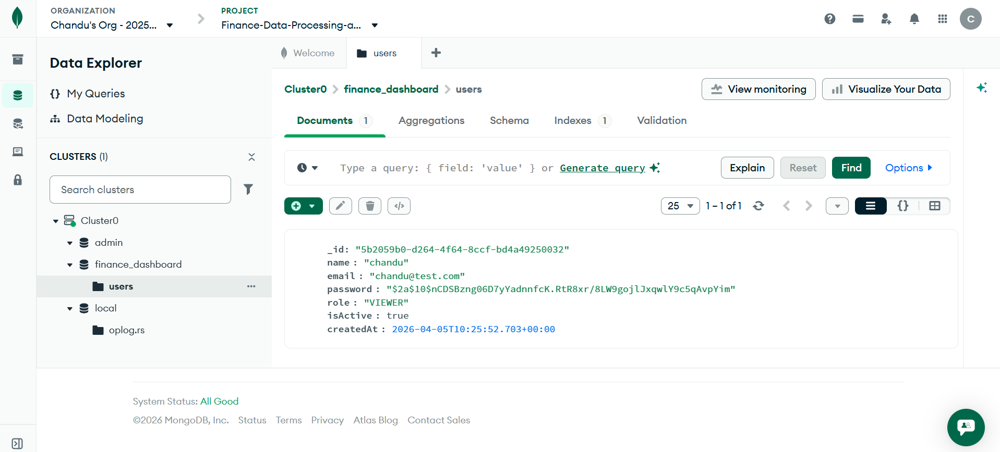

# Finance Dashboard API

REST API for a finance dashboard: **JWT authentication**, **role-based access control (RBAC)**, **financial record CRUD** (soft delete), and **dashboard aggregations** on **MongoDB** with **Prisma**.

**Roles:** `VIEWER` · `ANALYST` · `ADMIN` — see [Access control summary](#access-control-summary) and the [endpoint table](#api-endpoints--access-control).

---

## Tech stack

Node.js, Express, Prisma, **MongoDB**, JWT (`jsonwebtoken`), bcryptjs, Zod.

---

## Getting started

1. **MongoDB must be a replica set** (Prisma requirement for writes). Easiest options:
   - **[MongoDB Atlas](https://www.mongodb.com/cloud/atlas)** (free tier) — already a replica set. Copy **`mongodb+srv://…`** into **`DATABASE_URL`**.
   - **Docker** (local): `docker compose up -d`, then run **once** on your machine:  
     `mongosh "mongodb://127.0.0.1:27017" --eval 'rs.initiate({ _id: "rs0", members: [{ _id: 0, host: "127.0.0.1:27017" }] })'`  
     Use **`DATABASE_URL="mongodb://127.0.0.1:27017/finance_dashboard"`** in `.env`.
   - **Installed `mongod`:** start with replication, e.g. `mongod --replSet rs0 --port 27017 --dbpath <path>`, then `mongosh` → `rs.initiate()`.

2. From the repository root (folder with `package.json`):

```bash
npm install
copy .env.example .env
```

macOS / Linux: `cp .env.example .env`

3. Edit **`.env`**: set **`DATABASE_URL`** to your connection string (must start with `mongodb://` or `mongodb+srv://`). See `.env.example`.

4. Push the Prisma schema to the database and seed:

```bash
npx prisma generate
npm run db:push
npm run db:seed
npm start
```

Dev with reload: `npm run dev` · **Base URL:** `http://localhost:8000` (or `PORT` in `.env`).

**Checks:** `npm test` (unit-style) · With server running: `node scripts/smoke-api-test.mjs`

MongoDB does not use SQL migrations in this repo; use **`npm run db:push`** whenever you change `prisma/schema.prisma`.

---

## Environment variables

| Variable | Description |
|----------|-------------|
| `PORT` | HTTP port (default `8000`). |
| `NODE_ENV` | `development` or `production`. |
| `DATABASE_URL` | MongoDB URI, e.g. `mongodb://127.0.0.1:27017/finance_dashboard` or Atlas `mongodb+srv://...`. |
| `JWT_SECRET` | Secret for signing JWTs. |
| `JWT_EXPIRES_IN` | Token lifetime (e.g. `7d`). |

---

## Authentication

1. `POST /api/auth/login` or `POST /api/auth/register` → read `data.token`.
2. Protected routes:

```http
Authorization: Bearer <your_jwt_here>
Content-Type: application/json
```

Inactive users get **403** even with a valid token. The server loads the user from the database each request for authoritative **role** and **isActive**.

---

## Access control summary

| Role | Records (`/api/records`) | Dashboard |
|------|---------------------------|-----------|
| **VIEWER** | List/get **own** rows only | **`/recent` only** (own). No summary / by-category / trends. |
| **ANALYST** | List/get **own** rows | **Summary, by-category, trends, recent** (all scoped to **own** data). |
| **ADMIN** | List/get **all** rows; **create, update, soft-delete** | **All dashboard routes**; aggregates over **all** records where applicable. |
| **All** | — | — |

**Users:** Only **ADMIN** may use `/api/users` (list, get, change role, change active status).

**Registration:** `POST /api/auth/register` creates **VIEWER** accounts. Admins promote users via `PATCH /api/users/:id/role` and `PATCH /api/users/:id/status`.

---

## API endpoints & access control

| Method | Path | Access | Description |
|--------|------|--------|-------------|
| `GET` | `/health` | **Public** | Liveness check. |
| `POST` | `/api/auth/register` | **Public** | Register; new user is **VIEWER**. Body: `name`, `email`, `password` (min 8). → **201** + `data.user`, `data.token`. |
| `POST` | `/api/auth/login` | **Public** | Body: `email`, `password`. → **200** + `data.user`, `data.token`. |
| `GET` | `/api/users` | **JWT + ADMIN** | List users. |
| `GET` | `/api/users/:id` | **JWT + ADMIN** | Get user by id. |
| `PATCH` | `/api/users/:id/role` | **JWT + ADMIN** | Body: `{ "role": "VIEWER" \| "ANALYST" \| "ADMIN" }`. |
| `PATCH` | `/api/users/:id/status` | **JWT + ADMIN** | Body: `{ "isActive": true \| false }`. |
| `GET` | `/api/records` | **JWT** (any role) | Paginated list. **Scope:** VIEWER/ANALYST → own; ADMIN → all. Query: `type`, `category`, `from`, `to`, `page`, `limit`. |
| `GET` | `/api/records/:id` | **JWT** (any role) | Get one record (same scope as list). |
| `POST` | `/api/records` | **JWT + ADMIN only** | Create. Body: `amount` (>0), `type` (`INCOME`\|`EXPENSE`), `category`, `date`, optional `notes`, optional `userId` (admin assigns owner). |
| `PATCH` | `/api/records/:id` | **JWT + ADMIN only** | Update; at least one of `amount`, `type`, `category`, `date`, `notes`. |
| `DELETE` | `/api/records/:id` | **JWT + ADMIN only** | Soft delete (`deletedAt` set). |
| `GET` | `/api/dashboard/summary` | **JWT + ANALYST or ADMIN** | Totals, net balance, counts. Scoped: analyst → own; admin → all. **VIEWER → 403.** |
| `GET` | `/api/dashboard/by-category` | **JWT + ANALYST or ADMIN** | Grouped totals. Same scope. **VIEWER → 403.** |
| `GET` | `/api/dashboard/trends` | **JWT + ANALYST or ADMIN** | Query: `period=monthly` (default) or `weekly`. Same scope. **VIEWER → 403.** |
| `GET` | `/api/dashboard/recent` | **JWT** (any role) | Up to 10 recent rows. ADMIN → all users; others → own. |

**Typical errors:** **401** missing/invalid token or bad login · **403** wrong role or inactive account · **404** not found / not visible · **400** validation · **409** duplicate email on register.

---

## Response shape (short)

**Success:** `{ "success": true, "data": …, "message": "…" }` — lists of records also include `pagination: { page, limit, total }`.

**Error:** `{ "success": false, "message": "…", "code": "UNAUTHORIZED" | "FORBIDDEN" | … }` — validation may include `errors: [{ "path", "message" }]`.

---

## Example (cURL)

```bash
BASE="http://localhost:8000"
curl -s "$BASE/health"

curl -s -X POST "$BASE/api/auth/login" \
  -H "Content-Type: application/json" \
  -d '{"email":"admin@test.com","password":"Admin@123"}'

# Use data.token from the response:
TOKEN="<paste_jwt_here>"
curl -s "$BASE/api/users" -H "Authorization: Bearer $TOKEN"
curl -s "$BASE/api/records?page=1&limit=5" -H "Authorization: Bearer $TOKEN"
curl -s "$BASE/api/dashboard/summary" -H "Authorization: Bearer $TOKEN"
```

---

## Test users (after `npm run db:seed`)

| Role | Email | Password |
|------|-------|----------|
| ADMIN | `admin@test.com` | `Admin@123` |
| ANALYST | `analyst@test.com` | `Analyst@123` |
| VIEWER | `viewer@test.com` | `Viewer@123` |

Seed adds ~20 sample records across these users.

---

## Deploying on Vercel

This app targets **MongoDB** (e.g. **MongoDB Atlas**). Set **`DATABASE_URL`** in Vercel to your Atlas connection string (`mongodb+srv://...`). Run **`npx prisma generate`** on build (already covered by **`postinstall`**) and apply the schema once with **`npx prisma db push`** from your machine (using the production URI) or your CI. Add **`JWT_SECRET`**, **`JWT_EXPIRES_IN`**, **`NODE_ENV=production`**.

**Live URL:** `https://<project>.vercel.app` — try `GET /health` and `POST /api/auth/login`.

---

## Screenshots

MongoDB / Atlas (collections and data for this API):



API testing with Postman (e.g. login or authenticated request):


Place both image files in the **repository root** next to `README.md` (`database.png`, `postman.png`). GitHub and most Markdown viewers render these automatically.

---

**Author:** chandu pn · chandupn.05@gmail.com
